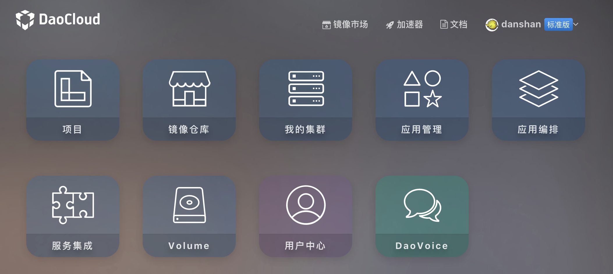
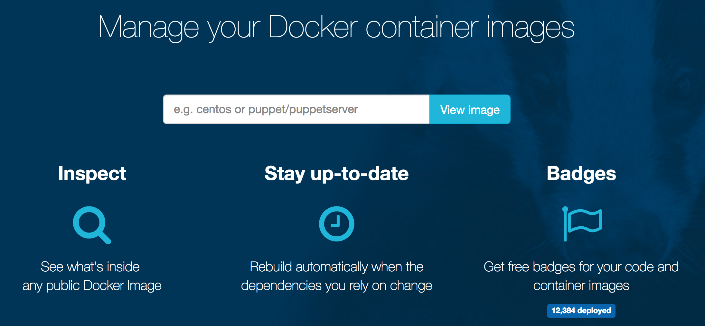
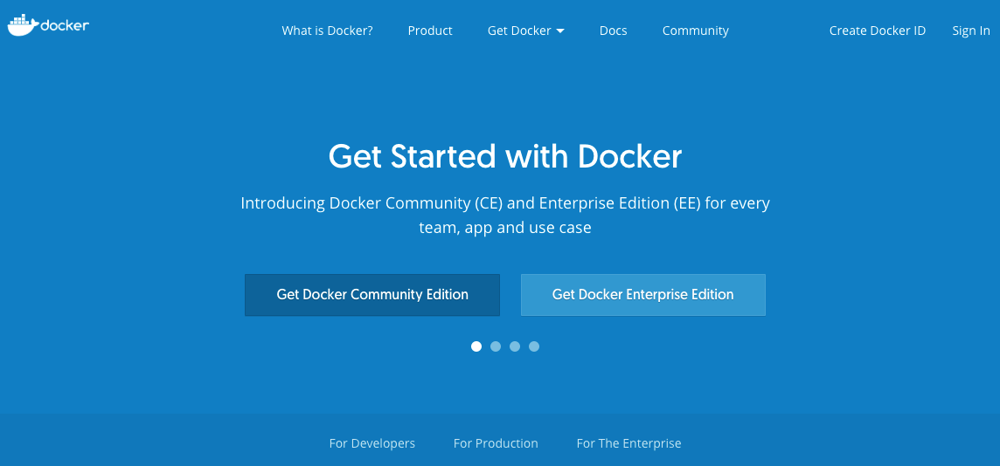
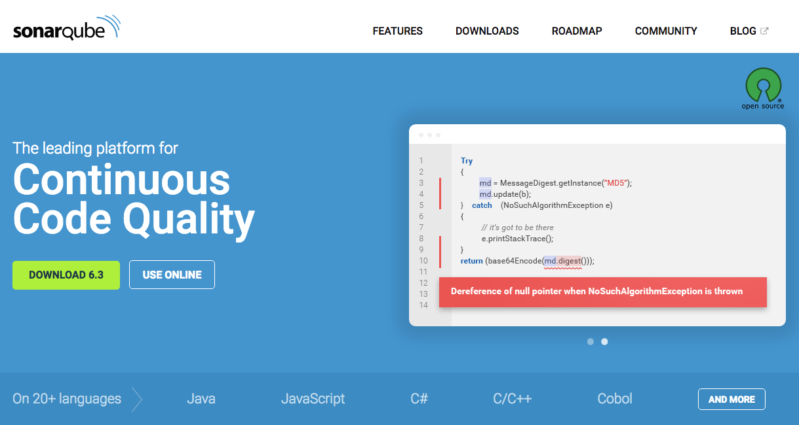
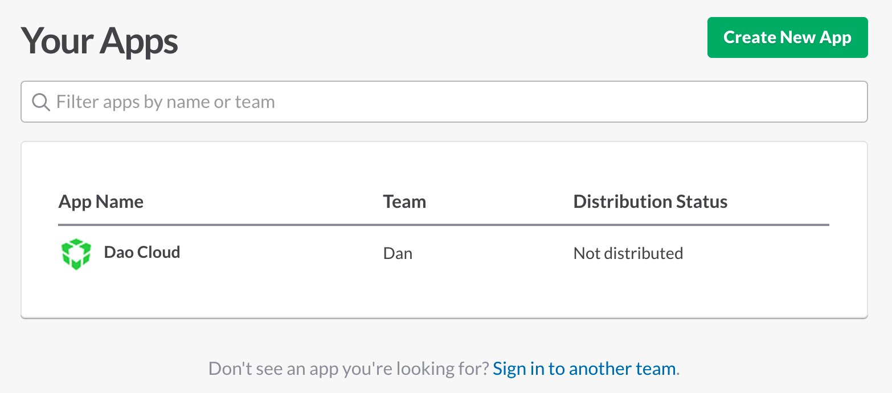
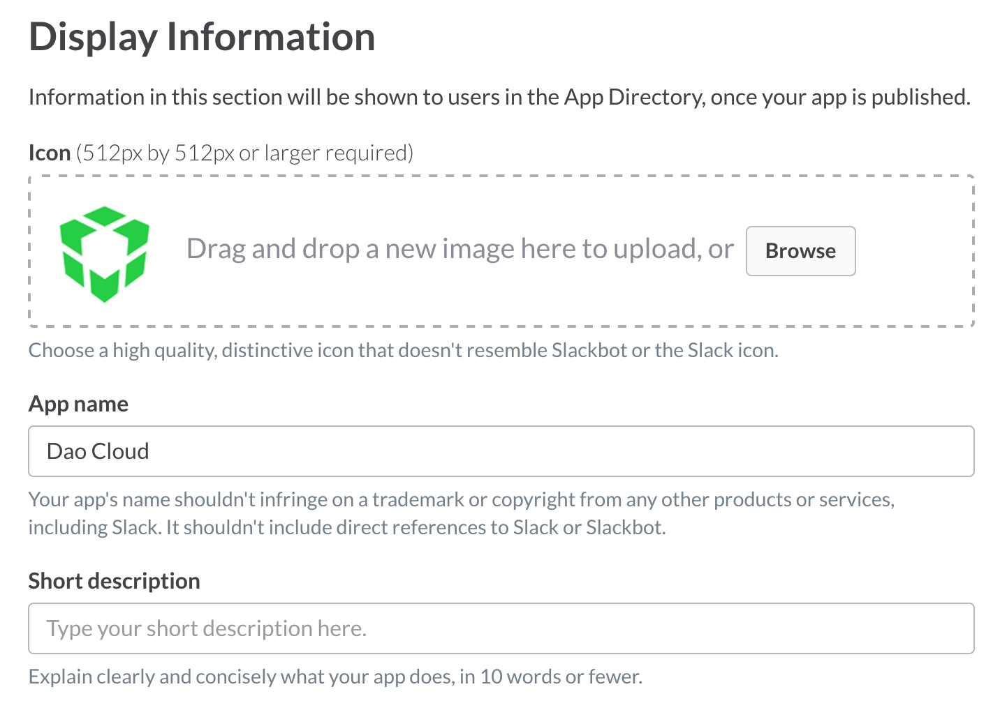
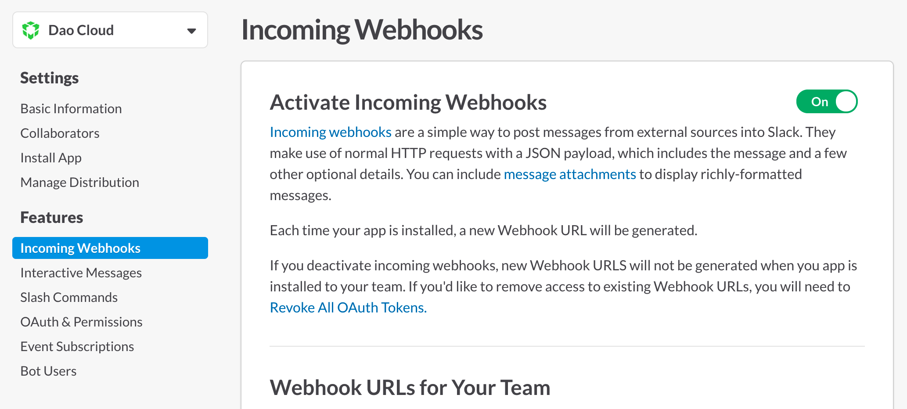

# webhook-slack

[](https://github.com/danshan/webhook-slack)
[](https://github.com/danshan/webhook-slack)

[](https://hub.docker.com/r/danshan/webhook-slack/)
[](https://hub.docker.com/r/danshan/webhook-slack/)
[](https://hub.docker.com/r/danshan/webhook-slack/)
[](https://hub.docker.com/r/danshan/webhook-slack/)

[](https://microbadger.com/images/danshan/webhook-slack)
[](https://microbadger.com/images/danshan/webhook-slack)

[](https://travis-ci.org/danshan/webhook-slack)
[](https://coveralls.io/r/danshan/webhook-slack?branch=master)
[](https://codeclimate.com/github/danshan/webhook-slack)
[](https://codeclimate.com/github/danshan/webhook-slack)
[](https://sonarqube.com/dashboard?id=com.shanhh.webhook%3Awebhook-slack)
[](https://sonarqube.com/dashboard?id=com.shanhh.webhook%3Awebhook-slack)

该项目的目的是解决一些支持 Webhook 缺无法集成到 Slack 的产品.

通过 Slack 的 [Incoming Webhooks](https://api.slack.com/incoming-webhooks) 来实现将消息通过 slack 转发.

目前支持的应用有:

* [DaoCloud](https://www.daocloud.io/)



* [MicroBadger](https://microbadger.com)



* [Docker](https://docker.io)



* [SonarQube](https://www.sonarqube.org/)



## Create Webhook

在 [Slack Apps](https://api.slack.com/apps) 中创建一个 App, 以 DaoCloud 为例:



进入应用后可以给你的应用设置它的 icon.



在左侧的 Incoming Webhooks 中创建一个针对这个应用的 webhook. 



## Build

在 java 8 下测试通过

```shell
mvn clean package
```

## Run

支持两种方式启动项目:

### Run as java application

```shell
java -jar -Dslack.daocloud=<daocloud_webhook_url> target/webhook-slack.jar
```

### Run in [docker](https://www.docker.com/)

docker-compose.yaml

```yaml
webhook-slack:
  image: daocloud.io/danshan/webhook-slack:master-00c578a
  command: ls /opt/data && /bin/bash /opt/data/entrypoint.sh
  privileged: false
  restart: always
  ports:
  - 8080:8080
  environment:
  - SLACK_DAOCLOUD=<daocloud_webhook_url>
  - SLACK_MICROBADGER=<_webhook_url>
```

### Test

```shell
curl -X "POST" "http://127.0.0.1:8080/webhook/daocloud" \
     -H "Content-Type: text/plain; charset=utf-8" \
     -d $'{
  "repo": "daocloud/api",
  "image": "daocloud.io/daocloud/api:master-init",
  "build_flow_id": "8d7622ea-9323-4489-8c8e-fc4bed448961",
  "name": "api",
  "build": {
    "status": "Success",
    "duration_seconds": 180,
    "author": "DaoCloud",
    "triggered_by": "tag",
    "sha": "a7c35d9dc7e93788ce81befbadeb0108de495e5e",
    "tag": "master-init",
    "branch": null,
    "pull_request": "",
    "message": "init build ",
    "started_at": "2015-01-01T08:20:00+00:00",
    "build_type": "image_build"
  }
}'
```